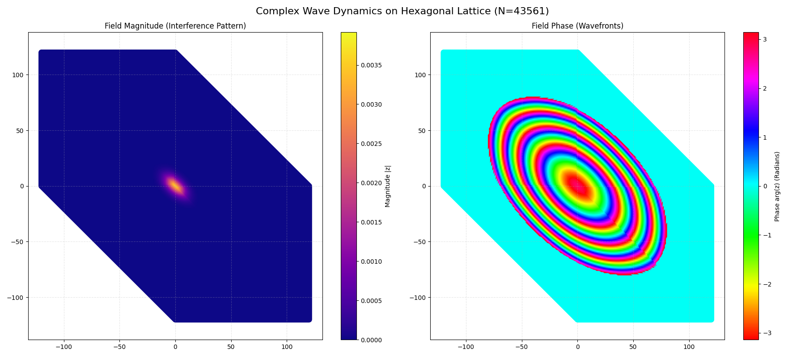
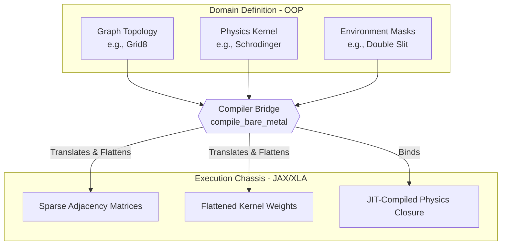

# Field Dynamic System (FDS) - JAX Backend

> **A Proof-of-Concept physics engine that compiles high-level Object-Oriented simulations into high-performance JAX closures.**


*Above: A 900-step quantum random walk interference pattern (featuring double-slit environmental constraints and native wave collapse) executed in under 1 second.*

## 📊 Domain Flexibility: Classical vs. Quantum

The framework is agnostic to the physics being simulated. By simply swapping the underlying kernel, the engine seamlessly shifts from standard thermodynamics to quantum mechanics. 

Below is a side-by-side comparison of the same entity evolving on a 2D grid, differentiated only by the physics kernel applied:

<p align="center">
  
  &nbsp; &nbsp; &nbsp; &nbsp;
  
</p>

* **Left (Classical Walker):** Driven by a `StandardDiffusionKernel`. The probability spreads smoothly and symmetrically, representing standard Brownian motion or heat dissipation.
* **Right (Quantum Walker):** Driven by the `DiscreteSchrodingerKernel`. The complex amplitudes create sharp interference patterns and wave-like reflections against the boundaries before the wave function collapses.

## 🏛️ Architecture: The Compiler Bridge

The core innovation of this repository is the separation of **Domain Definition** (human-readable OOP) from **Hardware Execution** (bare-metal JAX tensors). 

Rather than forcing the user to write JAX array manipulations by hand, the system uses a compiler bridge. The `compile_bare_metal()` factory traverses the user's defined topology, extracts the adjacency matrices and kernel weights, flattens them, and constructs a highly optimized `from_raw_data` execution chassis.


## 🚀 Quick Start: Initializing a System

The goal of FDS is to make complex simulations declarative. You define the rules, and the compiler handles the hardware execution. Here is a minimal example of initializing and running a system:
```python
import jax
from src.field_dynamic_system import DiscreteFieldDynamicSystem, Grid8Topology
from src.physics import DiscreteSchrodingerKernel, raw_quantum_collapse_operator
from src.clock import HistoryClock

# 1. DEFINE THE WORLD (OOP)
topology = Grid8Topology()
generator = GenericMarkovianDiscreteFieldGenerator(kernel=DiscreteSchrodingerKernel())

# 2. COMPILE TO BARE-METAL (The Magic)
clock = HistoryClock()
system = DiscreteFieldDynamicSystem.compile_bare_metal(
    topology=topology,
    generator=generator,
    start_state=(0, 0),
    entity_operator_fn=raw_quantum_collapse_operator,
    clock=clock,
    expansion_depth=40 # Automatically generates the graph depth
)

# 3. EXECUTE AT C++ SPEED
# The framework handles the JAX wave evolution, observation, and wave collapse natively.
key = jax.random.PRNGKey(42)
context = {'rng_key': key, 'global_params': {'steps': 900}}

# Run 900 simulation steps instantly
system.apply_operator(context_kwargs=context)

print(f"Final Collapsed Entity Node ID: {system.get_raw_data()}")
```

## ✨ Key Capabilities

1. **Zero-Cost Abstractions:** Developers can build complex worlds using standard, readable Python classes (e.g., `Grid8Topology`, custom step composers, and discrete kernels). The compiler strips these away at runtime, executing pure JAX arrays.
2. **Native Quantum Mechanics:** The framework natively handles the mathematics of observation. When the operator samples the field to determine the entity's new state, the system automatically triggers a mathematically accurate wave collapse (a Dirac/Kronecker delta) before the next evolutionary step.
3. **Hardware Sympathy:** By flattening graph topologies into sparse matrices and moving the physics logic into pure closures, the execution loop bypasses Python's interpreter entirely. Matrix operations take advantage of SIMD, allowing massive simulations to run on a standard CPU in milliseconds.
4. **Pluggable Physics Kernels:** The environment is agnostic to the physics being simulated. By simply swapping a `StandardDiffusionKernel` with a `DiscreteSchrodingerKernel`, the framework seamlessly shifts from simulating heat transfer to simulating quantum wave interference.

---

## 🏛️ Architecture & The Compiler Bridge

The core innovation of this repository is the separation of **Domain Definition** (OOP) from **Hardware Execution** (DOD/Tensors). 

Rather than forcing the user to write JAX array manipulations by hand, the system uses a compiler factory: `DiscreteFieldDynamicSystem.compile_bare_metal()`. 

This factory method traverses the user's defined topology and environmental masks, extracts the adjacency matrices and kernel weights, flattens them, and constructs a highly optimized `from_raw_data` execution chassis. The result is a system that reads like Python but runs like C.

---

## 🛑 Architectural Reflections & The Path Forward

*This repository is officially archived as a successful Proof of Concept.* 

The goal of this project was to test the boundaries of JAX in a dynamic, graph-based simulation environment and prove that high-level OOP could be bridged to bare-metal execution. The sub-second execution times for complex quantum walks prove that the math and the compiler bridge concept work perfectly.

However, pushing the architecture to its absolute limits revealed structural boundaries:
* **Tight Coupling:** As the complexity of interactions grew, strict interfaces between modules began to break down, leading to brittle integration points.
* **JAX Lock-in:** The backend became entirely hardcoded to JAX, defeating the purpose of a truly agnostic mathematical abstraction layer.

**The Pivot:** Rather than fighting technical debt to bolt a multi-entity system onto this foundation, I have taken the hard-earned lessons from this project—specifically regarding hardware sympathy, XLA compilation pipelines, and data-oriented design—and pivoted. 

I am currently developing a vastly superior **Entity-Component-System (ECS)** architecture designed from the ground up to solve these exact decoupling issues while maintaining this level of bare-metal performance. 

This POC proved the engine. The next iteration will prove the architecture.
