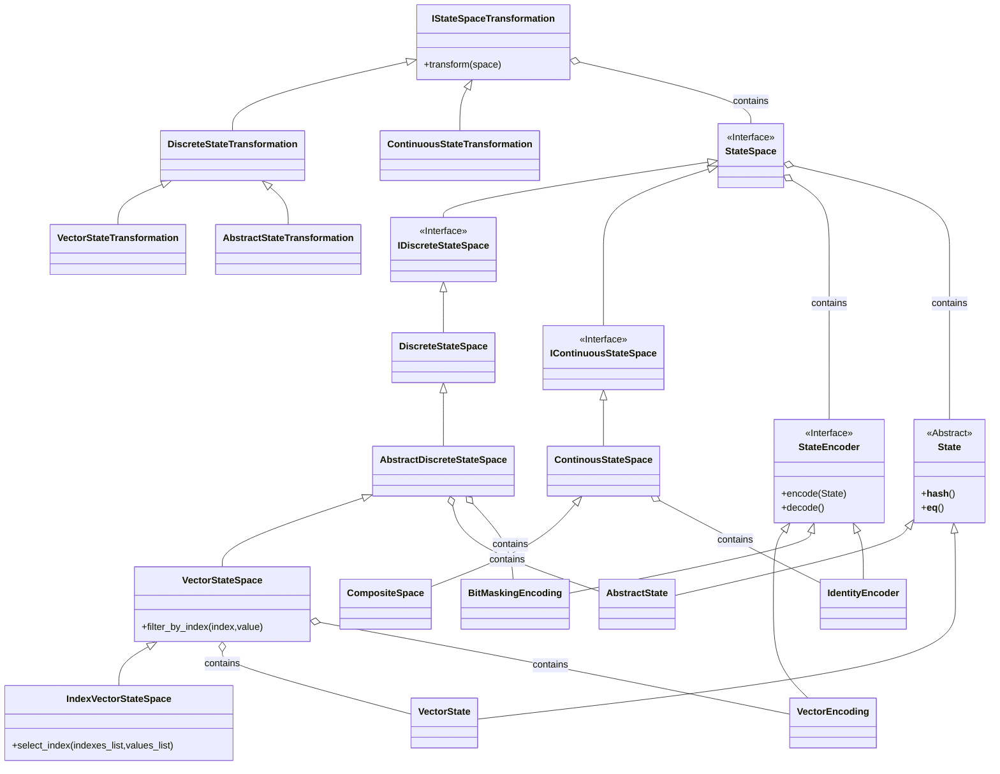

# 📘 User Guide: Core State Module

**Root Package:** `src.field_dynamic_system.core.state`

This module defines the "Territory" of the system. It is composed of the following components, reflecting the specific architecture of your system.

---

## 1. The Structure (File by File)

### 📂 `interfaces.py`
**The Contracts.** All other files depend on these base definitions.
* **`StateSpace`**: Root interface for all containers.
* **`IDiscreteStateSpace`**: Interface specifically for countable/finite spaces.
* **`IContinuousStateSpace`**: Interface specifically for geometric/infinite spaces.
* **`StateEncoder`**: Interface for translating `State` objects to/from Arrays.
* **`IStateSpaceTransformation`**: Interface for operations that transform one space into another.

### 📂 `state.py`
**The Atoms.** Defines the actual point objects.

| Class | Definition | Example Usage |
| :--- | :--- | :--- |
| **`State`** | Abstract base class. Defines hashing and equality. | N/A (Abstract) |
| **`VectorState`** | Immutable tuple wrapper. | `s = VectorState((1.0, 2.5))` |
| **`AbstractState`** | Named object. Equality depends only on `name`. | `s = AbstractState("Paris")` |

### 📂 `discrete.py`
**Countable Spaces.** Organized by hierarchy.

| Class | Definition | Key Features |
| :--- | :--- | :--- |
| **`DiscreteStateSpace`** | Base implementation for finite spaces. | Basic iteration. |
| **`AbstractDiscreteStateSpace`** | Stores `AbstractState` objects. | `contains(name)` |
| **`VectorStateSpace`** | specialized `AbstractDiscreteStateSpace` for Vectors. | `filter_by_index(idx, val)` |
| **`IndexVectorStateSpace`** | Specialized Vector space. | `select_index(indices, values)` |

### 📂 `continous.py`
**Uncountable Spaces.** Geometric regions.

| Class | Definition | Example Usage |
| :--- | :--- | :--- |
| **`ContinousStateSpace`** | Base implementation for infinite manifolds. | N/A (Base Class) |
| **`CompositeSpace`** | Combines spaces (Union/Intersection). | `shape = space_a.union(space_b)` |

### 📂 `encoding.py`
**Translators.**

| Class | Logic | Example Usage |
| :--- | :--- | :--- |
| **`IdentityEncoder`** | `(x, y) -> [x, y]` | `enc = IdentityEncoder(dim=2)` |
| **`VectorEncoding`** | Optimized for VectorState lists. | `enc = VectorEncoding(dim=3)` |
| **`BitMaskingEncoding`** | Maps arbitrary objects/names to bitmasks. | `enc = BitMaskingEncoding(dim=1, id_map={...})` |

### 📂 `transformation.py`
**Space Modifiers.**

| Class | Definition | Example Usage |
| :--- | :--- | :--- |
| **`DiscreteStateTransformation`** | Base for transforming finite sets. | N/A (Base Class) |
| **`ContinuousStateTransformation`** | Base for transforming manifolds. | N/A (Base Class) |
| **`VectorStateTransformation`** | JAX-accelerated vector mapping. | `t = VectorStateTransformation(op=my_jax_func)` |
| **`AbstractStateTransformation`** | Python-loop based node mapping. | `t = AbstractStateTransformation(op=my_py_func)` |

---

## 2. Usage Recipes

### Recipe A: Advanced Filtering (IndexVectorStateSpace)
*Using the specialized filtering capability.*

```python
from src.field_dynamic_system.core.state.discrete import IndexVectorStateSpace, VectorState

# 1. Create a space of 3D points
points = [(1, 2, 3), (1, 5, 5), (2, 2, 2)]
space = IndexVectorStateSpace(points, dim=3)

# 2. Select specific indices (e.g., where x=1)
# Assuming select_index takes a list of dimensions and list of target values
subset = space.select_index([0], [1])

### Recipe B: Transforming a Grid (Shift Coordinates)
*Files involved: `transformation.py`, `discrete.py`*

```python
import jax.numpy as jnp
from src.field_dynamic_system.core.state.transformation import VectorStateTransformation
from src.field_dynamic_system.core.state.discrete import VectorStateSpace

# 1. Define the Operation (JAX function)
def shift_right(vector):
    return vector + jnp.array([10.0, 0.0])

# 2. Define the Transformation
transformer = VectorStateTransformation(
    operation=shift_right,
    target_class=VectorStateSpace
)

# 3. Apply (Assuming 'grid' exists from Recipe A)
new_grid = transformer.transform(grid)
```

### Recipe C: Continuous Physics (The Box)
*Files involved: `continous.py`*

```python
import jax.numpy as jnp
# Note: Import matches actual filename 'continous.py'
from src.field_dynamic_system.core.state.continous import HypercubeSpace

# 1. Define a Room (0 to 10)
room = HypercubeSpace(low=[0.0], high=[10.0])

# 2. Project a point back into the room
invalid_point = jnp.array([15.0])
fixed_point = room.project(invalid_point)
print(f"Projected: {fixed_point}") # Output: [10.]
```

---

## 3. Class Architecture (UML)

