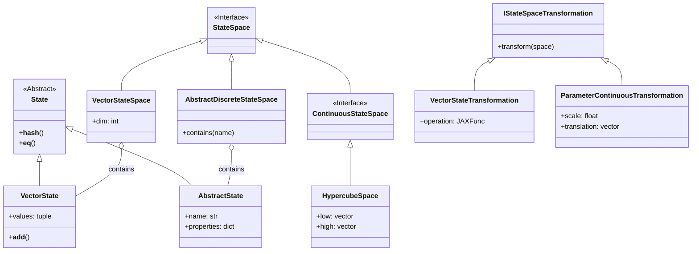

# 📘 User Guide: Core State Module

**Root Package:** `src.field_dynamic_system.core.state`

This module defines the "Territory" of the system. It is composed of the following components based on your file structure.

---

## 1. The Structure (File by File)

### 📂 `interfaces.py`
**The Contracts.** All other files depend on these base definitions.
* **`StateSpace`**: Abstract base for all containers (Discrete or Continuous).
* **`StateEncoder`**: Abstract base for translating Objects <-> Arrays.
* **`IStateOperation`**: Interface for functions that modify states.
* **`IStateSpaceTransformation`**: Interface for transforming entire spaces.

### 📂 `state.py`
**The Atoms.** Defines the actual point objects used in the system.

| Class | Definition | Example Usage |
| :--- | :--- | :--- |
| **`VectorState`** | Immutable tuple wrapper. Supports `+` and `-` arithmetic. | `s = VectorState((1.0, 2.5))` |
| **`AbstractState`** | Named object. Equality depends only on `name`. | `s = AbstractState("Paris", properties={"pop": 50})` |

### 📂 `discrete.py`
**Countable Spaces.** Collections of finite states.

| Class | Definition | Example Usage |
| :--- | :--- | :--- |
| **`VectorStateSpace`** | Set of `VectorState` objects. Enforces dimensions. | `space = VectorStateSpace([(0,0), (0,1)], dim=2)` |
| **`AbstractDiscreteStateSpace`** | Set of `AbstractState` objects. Uses HashMap for speed. | `space = AbstractDiscreteStateSpace(["Start", "End"])` |

### 📂 `continous.py`
**Uncountable Spaces.** Geometric regions defined by bounds.

| Class | Definition | Example Usage |
| :--- | :--- | :--- |
| **`HypercubeSpace`** | A Box defined by min/max vectors. Snaps invalid points. | `box = HypercubeSpace(low=[0.0], high=[10.0])` |
| **`HypersphereSpace`** | A Ball defined by center and radius. | `ball = HypersphereSpace(center=[0,0], radius=5.0)` |
| **`ContinuousStateSpace`** | Base class. Supports CSG (Union/Intersection). | `complex_shape = box.union(ball)` |

### 📂 `transformation.py`
**Space Modifiers.** Tools to convert one space into another.

| Class | Definition | Example Usage |
| :--- | :--- | :--- |
| **`VectorStateTransformation`** | Applies JAX function to every point in a grid. | `t = VectorStateTransformation(op=jax_func, target_class=VectorStateSpace)` |
| **`AbstractStateTransformation`** | Applies Python function to every node in a graph. | `t = AbstractStateTransformation(op=rename_func)` |
| **`ParameterContinuousTransformation`** | Shifts or scales the boundaries of a space. | `t = ParameterContinuousTransformation(scale=2.0, translation=jnp.array([1.]))` |

### 📂 `encoding.py`
**Translators.** Bridges the gap between Python Objects and JAX Arrays.

| Class | Definition | Example Usage |
| :--- | :--- | :--- |
| **`IdentityEncoder`** | Pass-through. `(x,y) -> [x,y]`. | `enc = IdentityEncoder(dim=2)` |
| **`BitMaskingEncoder`** | Mapping. `"Name" -> Index`. | `enc = BitMaskingEncoder(dim=1, id_to_obj={0:"A"})` |

---

## 2. Usage Recipes (Copy-Paste)

### Recipe A: Creating a Grid World
*Files involved: `discrete.py`, `state.py`, `encoding.py`*

```python
from src.field_dynamic_system.core.state.discrete import VectorStateSpace
from src.field_dynamic_system.core.state.state import VectorState
from src.field_dynamic_system.core.state.encoding import IdentityEncoder

# 1. Create Data
# We use tuples for raw data, VectorStateSpace converts them internally if needed
raw_points = [(0, 0), (0, 1), (1, 0), (1, 1)]

# 2. Initialize Space
grid = VectorStateSpace(
    allowed_states=raw_points,
    dim=2,
    _encoding=IdentityEncoder(dim=2)
)

# 3. Check States
s = VectorState((0, 1))
print(f"Is (0,1) valid? {grid.contains(s)}")
```

### Recipe B: Transforming a Grid (Shift Coordinates)
*Files involved: `transformation.py`, `discrete.py`*

```python
import jax.numpy as jnp
from src.field_dynamic_system.core.state.transformation import VectorStateTransformation
from src.field_dynamic_system.core.state.discrete import VectorStateSpace

# 1. Define the Operation (JAX function)
def shift_right(vector):
    return vector + jnp.array([10.0, 0.0])

# 2. Define the Transformation
transformer = VectorStateTransformation(
    operation=shift_right,
    target_class=VectorStateSpace
)

# 3. Apply (Assuming 'grid' exists from Recipe A)
new_grid = transformer.transform(grid)
```

### Recipe C: Continuous Physics (The Box)
*Files involved: `continous.py`*

```python
import jax.numpy as jnp
# Note: Import matches actual filename 'continous.py'
from src.field_dynamic_system.core.state.continous import HypercubeSpace

# 1. Define a Room (0 to 10)
room = HypercubeSpace(low=[0.0], high=[10.0])

# 2. Project a point back into the room
invalid_point = jnp.array([15.0])
fixed_point = room.project(invalid_point)
print(f"Projected: {fixed_point}") # Output: [10.]
```

---

## 3. Class Architecture (UML)

