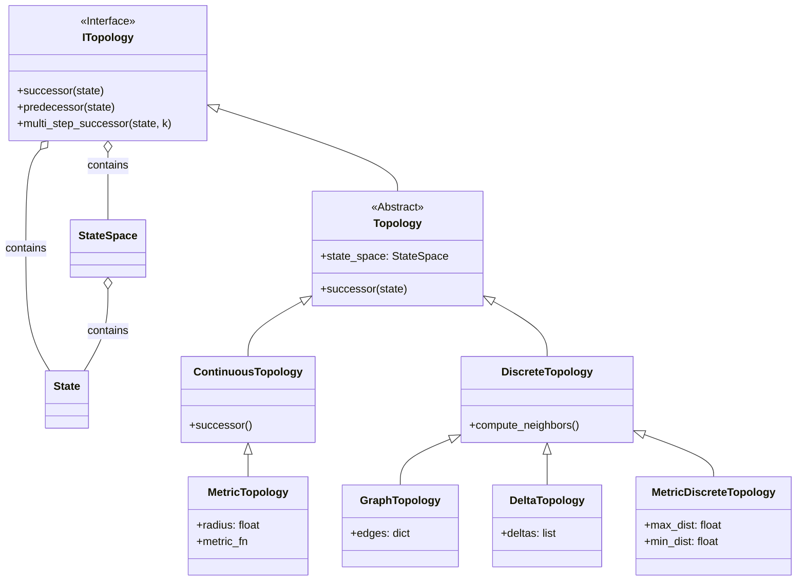

# 📘 User Guide: Neighbor Module (Topology)

**Root Package:** `src.field_dynamic_system.neighbor`

While the **State** module defines the "Map" (static locations), the **Neighbor** module defines the "Roads" (dynamic connections). It answers the question: *From my current state, where can I go next?*

This module is the starting point of system dynamics.

---

## 1. The Structure (File by File)

### 📂 `interfaces.py`
**The Contracts.** Defines how states relate to one another.

| Class | Definition | Example Usage |
| :--- | :--- | :--- |
| **`ITopology`** | Interface. Defines `successor(state)` and `predecessor(state)`. | N/A (Interface) |
| **`Topology`** | Abstract Base. holds the reference to the underlying `StateSpace`. | N/A (Abstract) |

### 📂 `discrete.py`
**Finite Connections.** Logic for Graph edges, Grid steps, or Discrete distances.

| Class | Definition | Example Usage |
| :--- | :--- | :--- |
| **`DiscreteTopology`** | Base for finite spaces. Optimizes neighbor lookups. | N/A (Base Class) |
| **`GraphTopology`** | Explicit connections (Edges). Best for social networks/cities. | `t = GraphTopology(state_space=s, edges={"A": ["B"]})` |
| **`DeltaTopology`** | Relative movement rules (Offsets). Best for Grids/Chess. | `t = DeltaTopology(state_space=s, deltas=[(0,1), (1,0)])` |
| **`MetricDiscreteTopology`** | Connects states if they are within a distance $D$ (e.g., K-NN). | `t = MetricDiscreteTopology(state_space=s, max_dist=5.0)` |

### 📂 `continuous.py`
**Infinite Connections.** Logic for geometric proximity.

| Class | Definition | Example Usage |
| :--- | :--- | :--- |
| **`ContinuousTopology`** | Base for infinite manifolds. | N/A (Base Class) |
| **`MetricTopology`** | Defines neighbors by a radius/distance function. | `t = MetricTopology(state_space=s, radius=2.5)` |

---

## 2. Usage Recipes (Copy-Paste)

### Recipe A: The Grid Walker (DeltaTopology)
*Use this for Cellular Automata, Chess, or Pixel logic.*

```python
from src.field_dynamic_system.core.state.discrete import VectorStateSpace, VectorState
from src.field_dynamic_system.neighbor.discrete import DeltaTopology

# 1. Setup the Space (The Board)
points = [(x, y) for x in range(5) for y in range(5)]
space = VectorStateSpace(points, dim=2)

# 2. Define the Rules (Up, Down, Left, Right)
# "Deltas" are relative steps you can take from any point
moves = [(0, 1), (0, -1), (1, 0), (-1, 0)]
topology = DeltaTopology(state_space=space, deltas=moves)

# 3. Get Neighbors
current = VectorState((2, 2))
neighbors = topology.successor(current)
# Output: [(2,3), (2,1), (3,2), (1,2)]
```

### Recipe B: The Road Network (GraphTopology)
*Use this for Logistics, Supply Chains, or Social Graphs.*

```python
from src.field_dynamic_system.core.state.discrete import AbstractDiscreteStateSpace, AbstractState
from src.field_dynamic_system.neighbor.discrete import GraphTopology

# 1. Setup the Space (The Cities)
space = AbstractDiscreteStateSpace(["Paris", "London", "Berlin"])

# 2. Define Explicit Edges
# Dictionary mapping: Source -> List of Destinations
connections = {
    "Paris": ["London", "Berlin"],
    "London": ["Paris"],
    "Berlin": ["Paris"]
}
topology = GraphTopology(state_space=space, edges=connections)

# 3. Get Neighbors
print(topology.successor(AbstractState("Paris")))
# Output: [AbstractState("London"), AbstractState("Berlin")]
```

### Recipe C: Proximity Sensor (MetricTopology)
*Use this for Physics, Swarm Intelligence, or Wireless signals.*

```python
import jax.numpy as jnp
from src.field_dynamic_system.core.state.continuous import HypercubeSpace
from src.field_dynamic_system.neighbor.continuous import MetricTopology

# 1. Setup Space (A 100x100 Room)
room = HypercubeSpace(low=[0,0], high=[100,100])

# 2. Define "Neighborhood" (Anything within 5.0 meters)
sensor_net = MetricTopology(state_space=room, radius=5.0)

# 3. Find Neighbors (Requires a list of candidates in continuous space)
# In continuous topology, we usually ask: "Who in this list is close to me?"
me = jnp.array([50.0, 50.0])
others = jnp.array([[52.0, 50.0], [80.0, 80.0]]) # One close, one far

visible = sensor_net.successor(me, candidates=others)
# Output: [[52.0, 50.0]]
```

---

## 3. Class Architecture (UML)

This diagram visualizes how the Topology modules inherit and interact.

